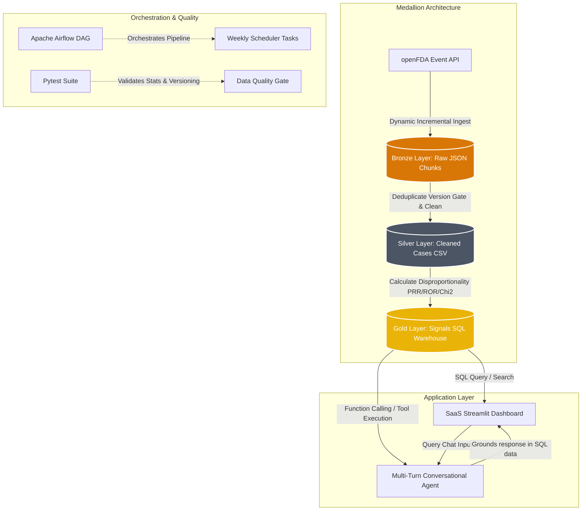

# FAERSight: Pharmacovigilance Signal Intelligence Pipeline

[](https://github.com/yourusername/pharma-drug-safety-pipeline/actions)
[](https://www.python.org/)
[](https://www.postgresql.org/)
[](https://streamlit.io/)
[](https://github.com/astral-sh/ruff)

An end-to-end production data engineering and pharmacovigilance analytics pipeline designed to ingest, process, clean, and analyze adverse-event reports from the FDA Adverse Event Reporting System (FAERS). 

Built using a **Medallion Data Lakehouse Architecture (Bronze ➔ Silver ➔ Gold)**, it implements **Incremental Ingestion**, executes high-performance vectorized safety calculations (PRR, ROR, Yates' $\chi^2$), standardizes free-text drug entries, and presents findings in a developer-first SaaS Dashboard powered by a **Multi-Turn Conversational RAG Agent** utilizing Gemini Function Calling.

---

## 🏗️ Architecture Overview



### Key Engineering & Domain Differentiators
1. **Production Medallion Data Architecture**: Organizes raw, semi-structured public API data into isolated data layers: Bronze (raw, date-stamped JSON chunks), Silver (normalized patient cases and standardized generic ingredients), and Gold (pre-aggregated safety signal tables loaded into SQLite/Postgres indexes).
2. **Incremental Ingestion Engine**: To prevent rate-limits and database bloat, the ingestion layer queries the database to find the latest `received_date` from previous runs and extracts only new reports from openFDA. Chunks are saved with date stamps to maintain an immutable raw historical ledger in Bronze.
3. **Deduplication Version Gate**: Adverse event reports frequently contain corrected or updated cases. The Silver cleaning gate flattens nested records and resolves duplicates by preserving only the highest `case_version` for any unique `case_id`.
4. **Boundary-Strict Drug Name Standardization**: Resolves raw, misspelled, and free-text brand names (e.g. *Humira Pen 40mg*, *Adalimumab-adaz*, *adalimumab*) into their standardized active generic ingredient using an internal mapping dictionary and non-alphabetic regex boundary matchers (`(?<![a-z])brand(?![a-z])`).
5. **Multi-Turn Conversational RAG with Function Calling**: Integrates a conversational agent powered by Gemini tool-execution. Gemini decides when and how to invoke database query tools (e.g. `get_drug_signals`, `compare_drugs`) to fetch statistics, ensuring natural follow-up conversation and factual grounding.

---

## 📊 Pharmacovigilance Math & Signal Strength

For every drug-reaction combination, the pipeline constructs a $2 \times 2$ contingency table:

| | Target Adverse Event | All Other Adverse Events | Total |
| :--- | :--- | :--- | :--- |
| **Target Drug** | **a** (Cases with Drug & Event) | **b** (Drug, No Event) | **a + b** (Total Drug Reports) |
| **All Other Drugs** | **c** (Other Drugs with Event) | **d** (Other Drugs without Event) | **c + d** (Total Other Reports) |
| **Total** | **a + c** (Total Event Reports) | **b + d** (Total Other Event Reports)| **N** (Total Database Reports) |

### Formulas & Statistics
*   **Proportional Reporting Ratio (PRR)**: Measures the reporting rate of the event in the target drug group vs the control group.
    $$PRR = \frac{a / (a + b)}{c / (c + d)}$$
*   **Reporting Odds Ratio (ROR)**: The odds of the event occurring with the target drug vs the comparison set.
    $$ROR = \frac{a \times d}{b \times c}$$
*   **Standard Error of $\ln(ROR)$ & 95% Confidence Intervals (CI)**:
    $$SE(\ln(ROR)) = \sqrt{\frac{1}{a} + \frac{1}{b} + \frac{1}{c} + \frac{1}{d}}$$
    $$CI_{95\%} = \left[ e^{\ln(ROR) - 1.96 \cdot SE}, \ e^{\ln(ROR) + 1.96 \cdot SE} \right]$$
*   **Yates' Corrected Chi-Square ($\chi^2$)**: Evaluates statistical significance, adjusting for small cell sizes to avoid false signals.
    $$\chi^2_{Yates} = \frac{N \left(|a d - b c| - \frac{N}{2}\right)^2}{(a+b)(c+d)(a+c)(b+d)}$$

### 🚦 4-Tier Signal Strength Badges
A combination is classified using a visual health-badge hierarchy based on reporting frequency and significance thresholds:
*   🔴 **Strong Signal**: Meets basic safety threshold with high disproportionality (`PRR >= 5.0` & `Chi-Square >= 15.0`).
*   🟡 **Moderate**: Meets safety criteria with moderate disproportionality (`PRR >= 3.0` & `Chi-Square >= 6.63` / representing $p < 0.01$).
*   🟢 **Weak**: Meets safety criteria (base threshold: `PRR >= 2.0` & `Chi-Square >= 3.84` / representing $p < 0.05$).
*   ⚪ **None**: Below thresholds (categorized as background noise).

---

## 🔬 Multi-Turn RAG Chatbot & Tools

The conversational safety assistant implements **Google Gemini Tool Calling** (Online Mode) and direct database queries (Offline Mode):
*   **Online Chat Session**: Utilizes `gemini-3.5-flash` (falling back to `gemini-2.5-flash` automatically at runtime if permissions require) to maintain context and history in `st.session_state`.
*   **Callable Gemini Tools**: Gemini decides when to call these registered local functions:
    *   `get_drug_signals(drug_name)`: Standardizes brand names and extracts active safety signals.
    *   `list_tracked_drugs()`: Lists target and control drug sets.
    *   `compare_drugs(drug_name1, drug_name2)`: Runs comparative statistical signals and calculates overlapping adverse events.
*   **Safety Guardrails**: Pre-programmed system instructions strictly forbid the model from recommending dosing, stating if a drug is "safe for the patient", or fabricating stats. Every statistic is grounded in tool results. A standing clinical disclaimer is appended to every response.

---

## 📂 Project Directory Structure

```text
pharma-drug-safety-pipeline/
├── .github/workflows/ci-cd.yml # GitHub Actions: Ruff linter & Pytest suite
├── dags/safety_pipeline_dag.py # Airflow DAG orchestrating Medallion pipeline
├── data/                       # Medallion data directory (git-ignored)
│   ├── active_drugs.json       # Config-driven drug list (overrides defaults)
│   ├── bronze/                 # Raw JSON payloads
│   ├── silver/                 # Normalized, cleaned CSVs
│   └── gold/                   # Aggregated signals, pipeline metadata, and SQLite DB
├── docker/
│   ├── Dockerfile              # App and Airflow container definition
│   └── docker-compose.yml      # Containerized PostgreSQL and Streamlit app
├── src/
│   ├── config.py               # Handles environment variables and dynamic active_drugs loading
│   ├── pipeline/               # Ingestion, cleaning, and statistics scripts
│   ├── app/                    # Streamlit dashboard, Plotly charts, and RAG agent
│   └── utils/                  # DB connection managers and synonym dictionaries
├── tests/                      # Pytest unit tests for ETL and statistics
└── run_pipeline.py            # Unified runner to trigger ETL steps
```

---

## 🚀 Getting Started

### 1. Installation
Clone the repository and install the dependencies:
```bash
git clone https://github.com/yourusername/pharma-drug-safety-pipeline.git
cd pharma-drug-safety-pipeline
python -m venv venv
source venv/bin/activate  # On Windows: venv\Scripts\activate
pip install -r requirements.txt
```

### 2. Configuration
Create a `.env` file from the template:
```bash
cp .env.template .env
```
Open `.env` and add your API keys:
```ini
OPENFDA_API_KEY=your_key_here  # Optional: speeds up queries
GEMINI_API_KEY=your_key_here  # Required for Online RAG
```
*(Note: If no API key is specified, the ingestion script automatically generates simulated FAERS records so you can run the pipeline immediately.)*

### 3. Execution
Run the entire pipeline (Bronze ➔ Silver ➔ Gold ➔ SQL Load):
```bash
python run_pipeline.py
```

Run unit tests to verify logic:
```bash
python -m pytest tests/
```

Start the Streamlit dashboard:
```bash
streamlit run src/app/app.py
```

---

## 🐳 Docker Deployment (PostgreSQL Backend)

The project includes a multi-container Docker compose environment that launches a PostgreSQL database alongside the Streamlit app.

To run:
```bash
cd docker
docker-compose up --build
```
Access the dashboard at `http://localhost:8501`. Data will automatically be written to the Docker-hosted PostgreSQL server instead of local SQLite.

---

## 🔗 Airflow Orchestration
To deploy the pipeline scheduler, place the contents of `dags/` into your Airflow DAGs directory. The DAG exposes a clean three-task pipeline: `ingest_bronze >> clean_silver >> analyze_gold` scheduled to run weekly.

---

## ⚠️ Statistical Limitations & Safety Boundaries

1. **Curated Comparator Population (Indication Bias Mitigation)**:
   This pipeline calculates disproportionality metrics using the curated list of 11 tracked target and control drugs rather than the entire FAERS database. 
   - *Advantage*: Controlling the comparison set to inflammatory-related drugs (Biologics vs NSAIDs) significantly mitigates **indication bias** (where the disease itself causes certain adverse events).
   - *Limitation*: The background rates ($c$ and $d$ cells) represent this cohort rather than the total FAERS universe, which can alter relative PRR/ROR values.
2. **Sparse Cell Artifacts**:
   In cases where an event occurs exclusively with the target drug and never with any comparator drugs ($c = 0$), the PRR formula denominator approaches zero. The pipeline applies Yates' continuity correction, but sparse cell combinations can report exceptionally high ratios (e.g. PRR > 1000). These should be evaluated alongside case count ($a$) and confidence interval ranges.
3. **No Medical Diagnostics**:
   FAERSight is a research utility. The safety signals flagged represent statistical associations only and do not establish a proven causal relationship between the drug and the adverse event. Dosing changes or clinical conclusions should never be made based solely on this tool.
